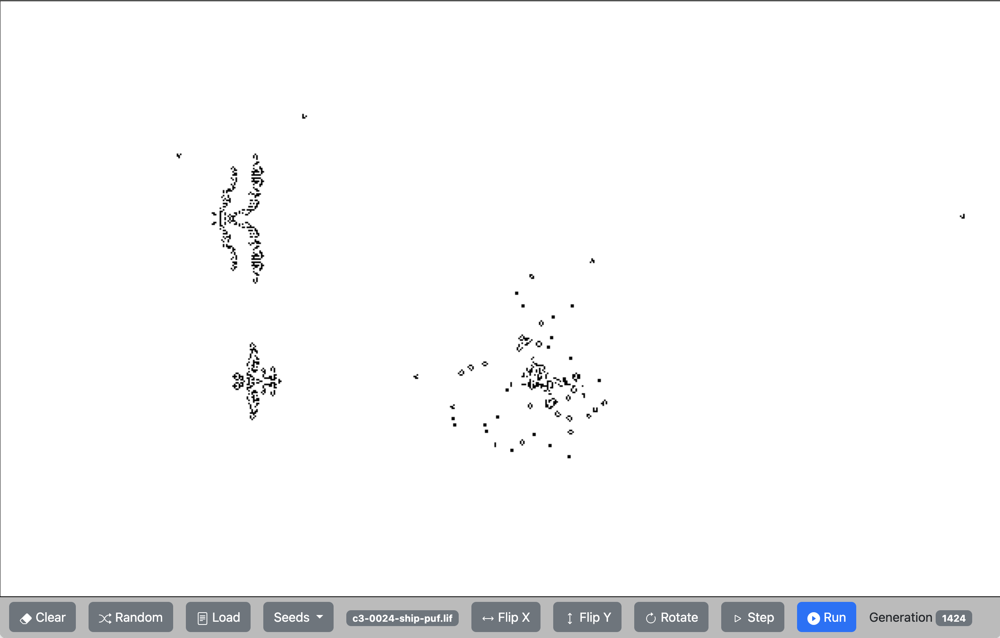

# Life

This is a simple way to explore [Conway's Game of Life](https://en.wikipedia.org/wiki/Conway%27s_Game_of_Life) in your browser. You can clone this or play with it directly from its [GitHub hosted page](https://ncotaasdnicey.github.io/life/).

The seeds drop down menu lets you pick from some well know patterns that you can then click to place in the viewer. However, a lot of folks have spent a long time discovering some amazing structures which you can load and use in the same way as seeds. Head to [Jason's Life](https://entropymine.com/jason/life/#collections) to get hold of some of these as zip files.

## How to use

When you first open, or when you resize the window it fills with random cells. You cann just click on Run to see how that plays out. Typically it will run for several thousands of generations before reaching a steady state. Click Run again to stop, and use Step to just run a single generation.

The Random button will also fill the viewer with random cells whilst, Clear will erase everything.

With a cleared viewer, you can explore the seeds, or load .lif files. The Rotate, Flip X, Flip Y buttons manipulate the seed.

## Implimentation

This is a pure Javascript, with a bit of help from Bootstrap and JQuery. The game of life automata is implemented as three methods, which scan the cells, sum thier values and then look up a new cell via a rule array, followinhg Conway's rules.

